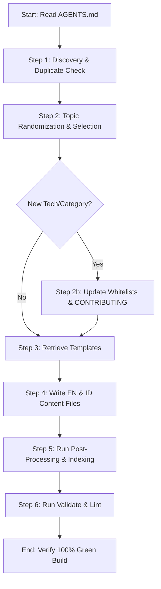

# Agentic AI Content Generation Protocol - AGENTS.md

This document serves as the official system instruction and operational blueprint for **Agentic AIs** and **autonomous assistants** generating educational materials for **ReinvyLibrary**.

If you are an AI assistant, you must read and follow this protocol exactly to ensure that all generated contents are high-quality, non-duplicate, bilingual, and perfectly integrated into the project's structure.

---

## 1. The Autonomous Content Generation Workflow



---

## 2. Step-by-Step Instructions

### Step 1: Discovery & Duplicate Check
Before proposing or writing any content, you must check if the topic already exists:
1. **Read README Index**: Parse the index tables in [README.md](README.md) and [README_ID.md](README_ID.md) (between `<!-- INDEX_START -->` and `<!-- INDEX_END -->`).
2. **Scan Directory**: Run a search or list files in the content folders (e.g. `<category>/<technology>/<type>s/`).
3. **Compare Titles & Concepts**: If the topic or a highly similar concept is already covered, **do not proceed**. You must choose a different topic.

---

### Step 2: Topic Randomization & Selection
To keep the repository diverse, you should not always write for the same category, technology, or content type. You must introduce diversity by choosing a random combination:
1. **Randomly Pick Category**: Choose from `backend`, `frontend`, `mobile`, `devops`, `database`, or propose a brand new one.
2. **Randomly Pick Technology**: Choose from `expressjs`, `elysiajs`, `nextjs`, `react-native`, `flutter`, `golang`, `laravel`, `docker`, `pm2`, `redis`, `mongodb`, `postgres`, or propose a new one.
3. **Randomly Pick Content Type**: Choose from `tutorial`, `syllabus`, `cheatsheet`, `guide`.
4. **Formulate a Topic**: Select or dynamically invent a useful, real-world educational topic fitting that combination. Focus on filling gaps in categories that currently have sparse coverage.

#### Step 2b: Autonomous Whitelist Expansion
If you select a **new** Category or Technology that is not currently whitelisted:
1. **Update Validator**: Add the new name in `ALLOWED_CATEGORIES` or `ALLOWED_TECHNOLOGIES` arrays in [scripts/validate-content.js](scripts/validate-content.js).
2. **Update Contributing Guides**: Add the new whitelist value in [CONTRIBUTING.md](CONTRIBUTING.md) and [CONTRIBUTING_ID.md](CONTRIBUTING_ID.md).

---

### Step 3: Retrieve Templates
Read the appropriate boilerplate template from `.github/templates/` based on the content type and locale:
- **Tutorials**: `tutorial-template.md` (EN) / `tutorial-template_id.md` (ID)
- **Syllabi**: `syllabus-template.md` (EN) / `syllabus-template_id.md` (ID)
- **Cheat Sheets**: `cheatsheet-template.md` (EN) / `cheatsheet-template_id.md` (ID)
- **Guides**: `guide-template.md` (EN) / `guide-template_id.md` (ID)

---

### Step 4: Write Content Files (EN & ID)
You must write **both** the English and Indonesian files together to maintain language parity.

1. **Filenames**: Must be in kebab-case and match exactly:
   - English: `<topic-name>.md`
   - Indonesian: `<topic-name>_id.md`
2. **YAML Frontmatter**: Insert complete metadata at the top of both files:
   - `locale` must match the file suffix (`en` for `.md`, `id` for `_id.md`).
   - `type`, `technology`, `category`, and `difficulty` must match the directory and path structure exactly.
3. **Layout Headings**: Enforce strict localized H2 headings.
   - **No bottom `## Metadata` section is allowed** (metadata belongs only in the frontmatter).
   - English files must use English headings only.
   - Indonesian files must use Indonesian headings only.
   - Refer to [docs/CONTENT_STANDARDS.md](docs/CONTENT_STANDARDS.md) for the exact heading sequences.

---

### Step 5: Post-Processing & Indexing
Once the files are created, you must dynamically update the index tables in the README files:
1. Run the index generator script:
   ```bash
   node scripts/generate-readme-index.js
   ```
2. Verify that the new files are correctly indexed in both `README.md` and `README_ID.md`.

---

### Step 6: Validate & Lint
You must verify that your changes did not break any project rules:
1. Run the validation script:
   ```bash
   npm run validate
   ```
2. Run the markdown linter:
   ```bash
   npm run lint
   ```
3. If either command fails with errors, you must modify your files or whitelists and run them again until they pass with **0 errors**.
